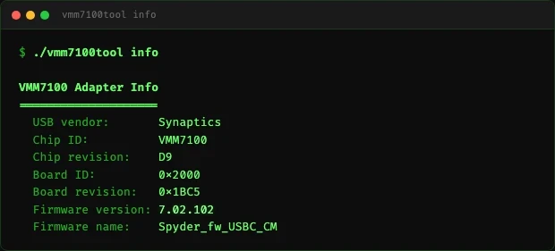
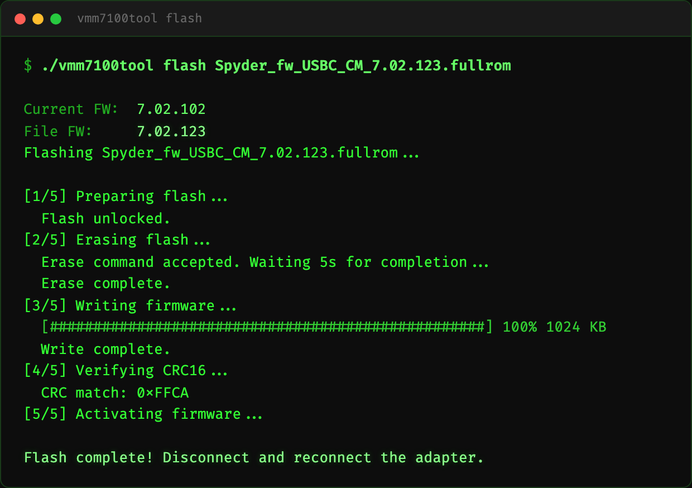
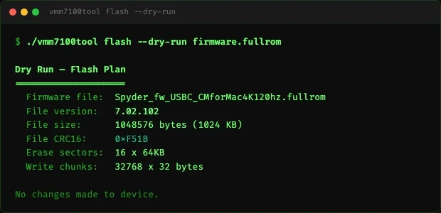
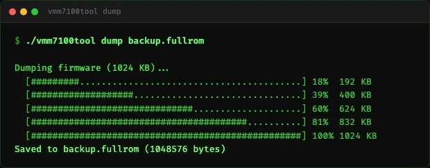
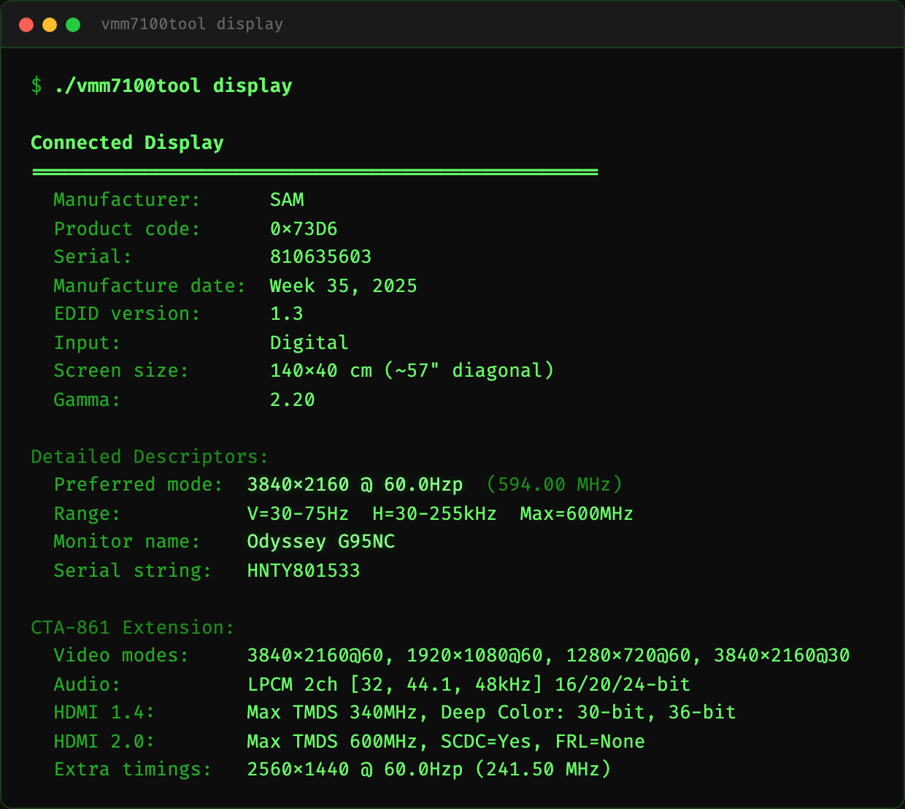
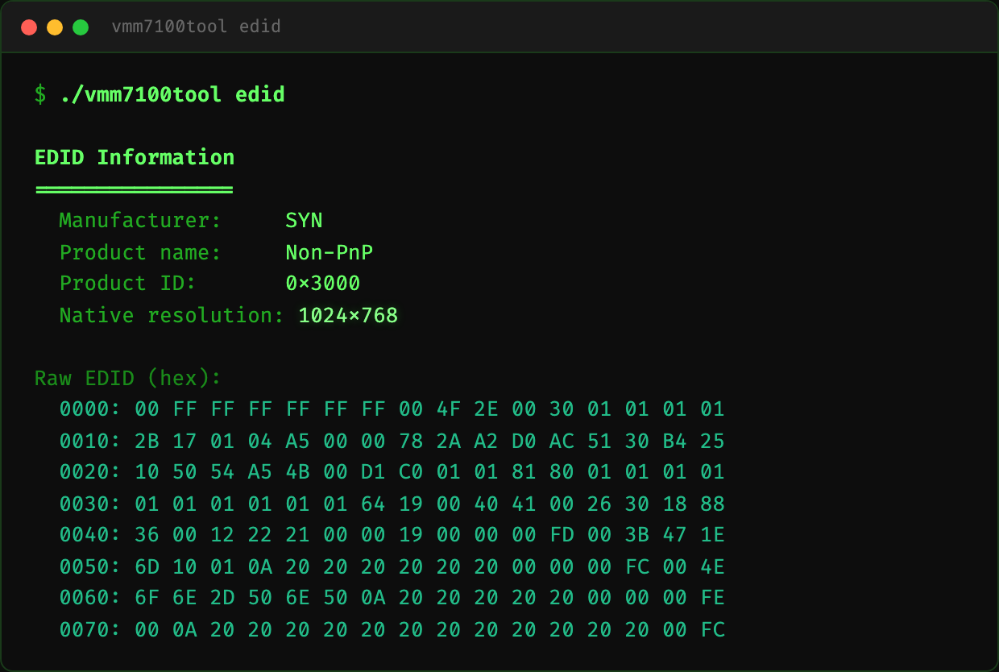
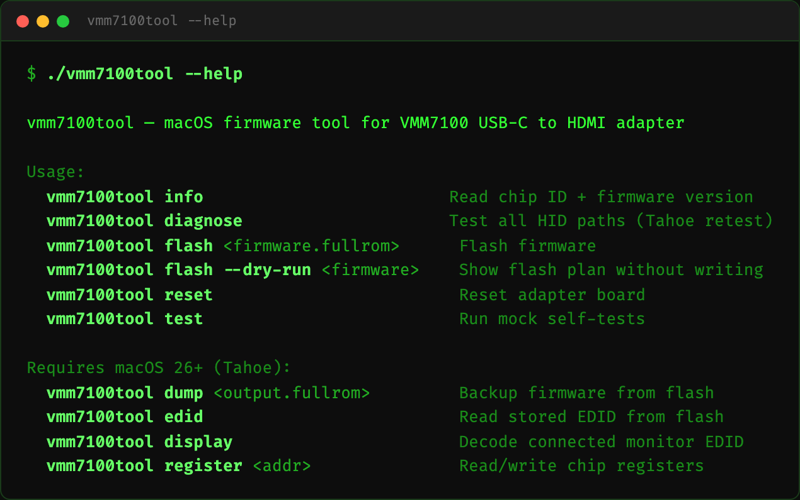

# vmm7100tool

Native macOS CLI tool for Synaptics VMM7100 USB-C to HDMI 2.1 adapters. Flash firmware, read device info, dump/restore, reset board — no Windows or VM required.

**Requires macOS 26+ (Tahoe)** for full functionality. Earlier macOS versions only support `info` (partial) and `reset`.

## Build

```bash
swiftc vmm7100tool.swift -o vmm7100tool
```

## Usage

```bash
# Read adapter info (FW version with patch, chip ID)
./vmm7100tool info

# Diagnose HID capabilities on current macOS
./vmm7100tool diagnose

# Backup current firmware
./vmm7100tool dump backup.fullrom

# Flash new firmware
./vmm7100tool flash firmware.fullrom

# Preview flash plan without writing (also reads version from file)
./vmm7100tool flash --dry-run firmware.fullrom

# Reset adapter board
./vmm7100tool reset

# Read stored EDID from flash
./vmm7100tool edid

# Read/write chip registers
./vmm7100tool register 0x507
./vmm7100tool register 0x507 0x01

# Run self-tests (no hardware needed)
./vmm7100tool test
```

## How it works

The VMM7100 chip exposes a USB HID interface (VID `0x06CB`, PID `0x7100`) with vendor-specific reports. The tool sends RC (Remote Control) commands via HID SET_REPORT/GET_REPORT to read chip info, erase flash, write firmware, and verify CRC.

No DP Alt Mode required — communication happens over USB data pins, not DisplayPort AUX channel.

## Safety

- `--dry-run` lets you preview the flash plan and read firmware version from file
- CRC16 verification after write
- `--force` to continue past CRC mismatch (use with caution)

## Tested Setup

### Hardware
- **Mac**: MacBook Pro M1 Max (macOS 26 Tahoe)
- **Display**: Samsung Odyssey G95NC (S57CG952), 4K 240Hz
- **USB-C to HDMI 2.1 adapter**: Cable Matters 201378 (Synaptics VMM7100) — FW 7.02.116 `BC_CM_MBP4k120`
- **USB-C to DP 2.1 adapter**: Chrontel CH7213D-based — 4K@120Hz
- **HDMI cable**: Ultra High Speed 48Gbps certified (required for 4K@120Hz)

### Result
Both adapters running **3840x2160 @ 120Hz** simultaneously on the same display.

### Samsung Odyssey G95NC HDMI port warning

Not all HDMI ports on the G95NC are equal:

| Port | Version | Max 4K | Notes |
|------|---------|--------|-------|
| HDMI 1 | HDMI 2.0 | 4K@60Hz | No FRL — will not do 120Hz regardless of adapter/cable |
| HDMI 2 | HDMI 2.1 | 4K@120Hz+ | Use this for VMM7100 adapter |
| HDMI 3 | HDMI 2.1 | 4K@120Hz+ | Use this for VMM7100 adapter |

If you're stuck at 4K@60Hz with a known-good adapter and cable, **check which HDMI port you're using**. HDMI 1 is a hardware limitation — no setting or firmware can upgrade it to 2.1 speeds.

## Firmware

The `firmware/` directory contains reference firmware images:

| File | Version | CRC16 | Description |
|------|---------|-------|-------------|
| `BC_CM_MBP4k120_7.02.116.fullrom` | 7.02.116 | 0x5668 | Dump from working Cable Matters adapter (4K@120Hz confirmed) |
| `Spyder_fw_USBC_CMforMac4K120hz.fullrom` | 7.02.102 | 0xF51B | Community 4K120 mod firmware from MacRumors thread |

Use `./vmm7100tool flash --dry-run <file>` to inspect a firmware image before flashing.

## Sources & References

- [vmm7100reset.swift](https://github.com/waydabber/vmm7100reset) — macOS IOKit USB HID communication pattern for VMM7100
- [fwupd synaptics-mst plugin](https://github.com/fwupd/fwupd/tree/main/plugins/synaptics-mst) — RC command protocol, register map, flash sequence
- [VmmDPTool passwords & reverse engineering](https://gist.github.com/mkem114/d685ff9c7368392c07e9118ab46609f7) — Synaptics tool internals
- [Cable Matters firmware update KB](https://kb.cablematters.com/index.php?View=entry&EntryID=147) — Windows firmware update instructions
- [VMM7100 firmware upgrade PDF](How%20to%20upgrade%20firmware%20for%20the%20VMM7100%20adapter.pdf) — Original Windows flashing guide
- [MacRumors 4K120Hz thread](https://forums.macrumors.com/threads/dp-usb-c-thunderbolt-to-hdmi-2-1-4k-120hz-rgb4-4-4-10b-hdr-with-apple-silicon-m1-m4-now-possible.2381664/) — Community discussion on VMM7100 firmware modding

## Status

### macOS 26+ (Tahoe) — full functionality
- `info` — chip ID, revision, full firmware version including patch (e.g. 7.02.123)
- `dump` — reads full 1MB firmware from flash
- `flash` — erase + write + CRC verify works end-to-end
- `edid` — reads stored EDID from flash
- `reset` — board reset via known-good packets
- `diagnose` — tests all HID paths and reports capabilities
- Mock tests: 23/23 passing

### macOS 15 and earlier — limited
- `info` — chip ID and major.minor version only (no patch)
- `reset` — works
- `dump`, `edid`, `register` reads — return zeros/stale data (HID driver limitation)
- `flash` — erase fails (error 3), writes are no-ops without erase

### What still doesn't work (any macOS version)
- `ReadFromMemory` at low addresses (0x0-0xFFFF, DPCD-mapped) — returns error code 1
- `ReadFromMemory` at high addresses (0x20000000+, 0x90000000+) — **works on Tahoe** (board ID, reset reg)
- Interrupt IN endpoint callback — never fires
- These limitations don't affect core functionality (flash/dump/info)

## Screenshots

### Adapter Info


### Firmware Flash


### Flash Dry Run


### Firmware Dump


### Connected Display (EDID decode)


### Stored EDID


### Help


## License

MIT
